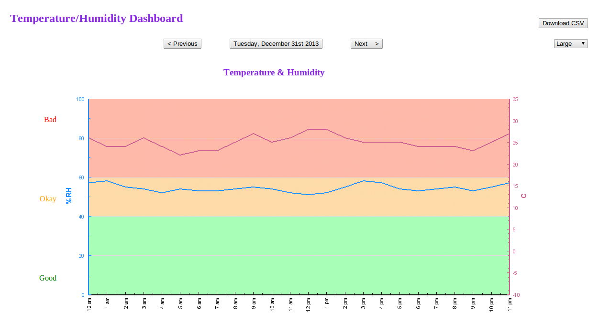
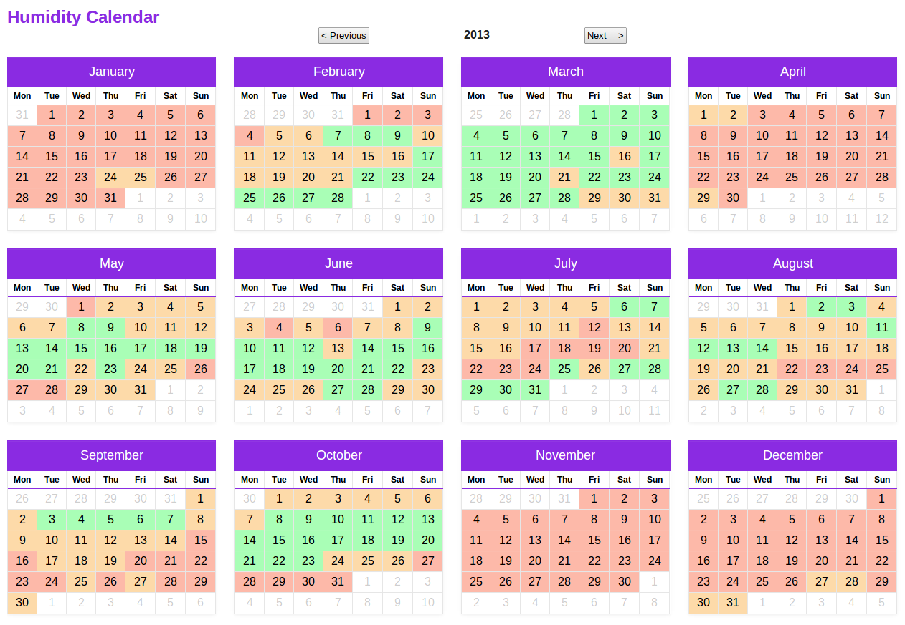
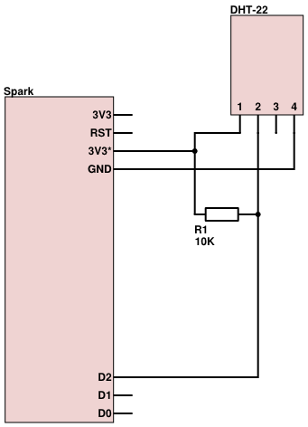

indoor-monitor-dashboard
==============================

### Directories
|Directory           |Description                                                      |
|--------------------|-----------------------------------------------------------------|
|ancillary           |Installation and setup instructions on Ubuntu 14.04              |
|dht22               |Firmware to send the temperature and humidity to the web pages   |
|www                 |PHP Web pages to view graphs of collected data                   |

### Screenshot

### DHT22 Schematic

  
   
  Reproduced from John-Daniel Trask
   
  <a href="https://raygun.io/blog/2014/09/home-automation-the-easy-way/">Home Automation the easy way: My experience with the Spark Core</a>

